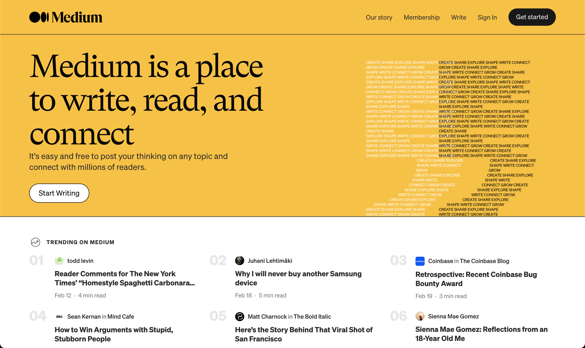

# STUDY SESSION Vol.1 | Basic HTML and CSS
(A learning material building )
## Goals
### HTML
- Learn basic tags and properties
- Be able to build the approximate structure my oneself
### CSS
- Learn basic stylings
- Understand the sizings (px, %, em, rem, vh, vw ...)
- Be able to use flex layout
- Be able to build sticky navigation bars
- Be able to make responsive websites (media query)
### SCSS
- Learn how SCSS works
- Be able to rewrite simple CSS into SCSS

## Sample website
We create a copy of [Medium](https://medium.com/) homepage. (Retrived on Feb 22, 2022) \
